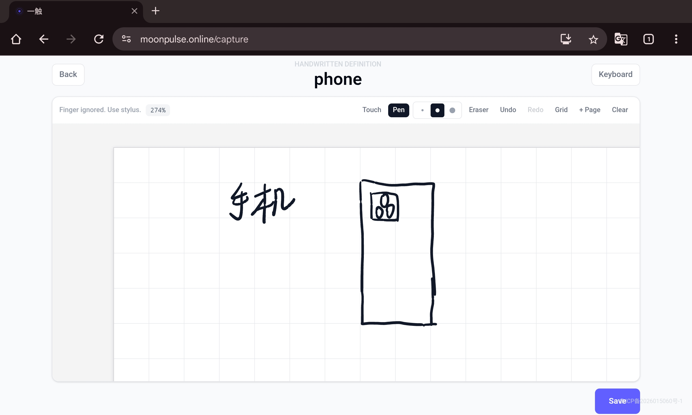
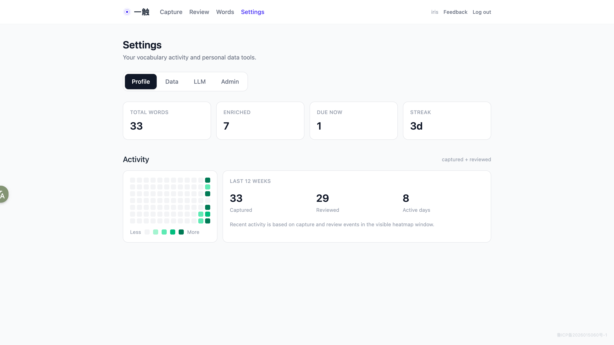
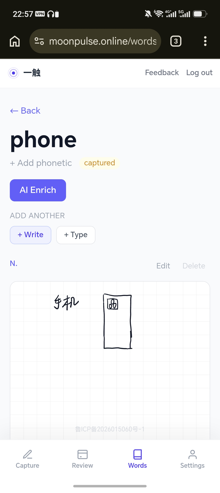
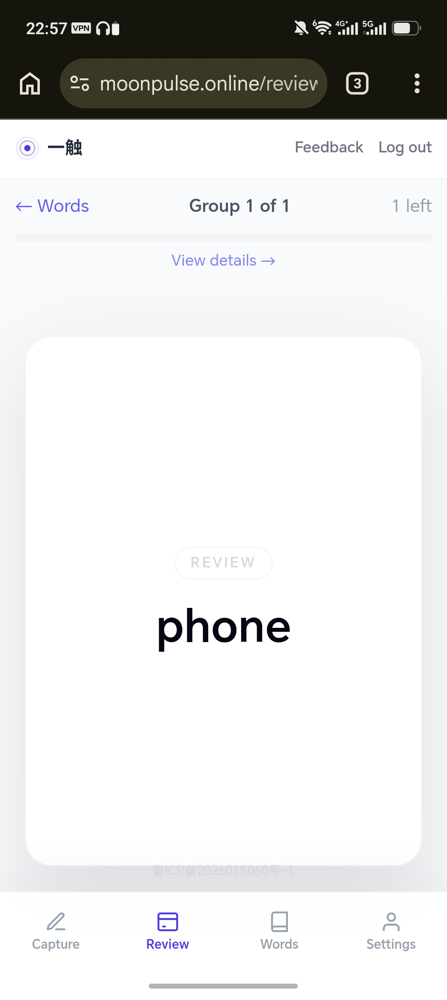
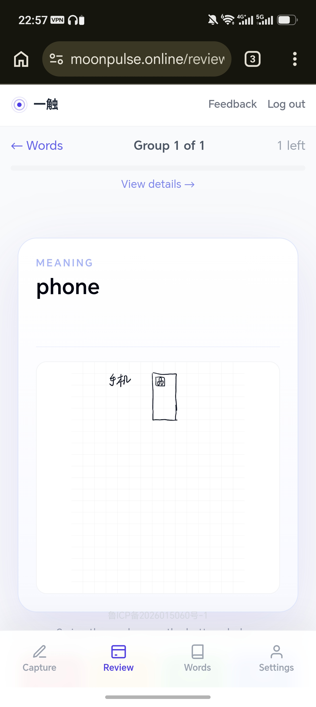

# 一触

> One touch, one word, one handwritten card. ✍️

**[English](#english) | [中文文档](README.zh-CN.md)**

一触 is a self-hosted vocabulary app built around handwriting-first capture, SM-2 review, offline-friendly workflows, and optional LLM enrichment.

**在线体验:** [moonpulse.online](https://moonpulse.online)

## Highlights

- ✍️ Handwritten definition cards on a full canvas
- 🧠 SM-2 spaced repetition review
- 📱 Mobile-friendly review flow
- 📴 Offline review queue support
- 🤖 Optional LLM enrich for phonetics, examples, and usage
- 🔐 Self-hosted FastAPI + React stack

## Screenshots

<table>
  <tr>
    <td width="50%"></td>
    <td width="50%"></td>
  </tr>
</table>

<table>
  <tr>
    <td width="33%"></td>
    <td width="33%"></td>
    <td width="33%"></td>
  </tr>
</table>>

## What it does

- Capture a word quickly.
- Pick handwriting or keyboard input.
- Save stroke data as `ink_data` and a render preview as `canvas_image`.
- Review the same handwritten card later.
- Optionally enrich the word with AI-generated support.

## Tech Stack

- FastAPI
- SQLAlchemy async ORM
- SQLite
- React
- TypeScript
- Zustand
- Vite

## Getting Started

```bash
cd backend
uv sync

cd ../frontend
npm install
```

Create `.env` from the example and run:

```bash
cd backend
uv run uvicorn backend.main:app --reload --port 8000

cd ../frontend
npm run dev
```

## Environment

Key variables:

- `GLM_WORDS_ADMIN_USERNAME`
- `GLM_WORDS_ADMIN_PASSWORD`
- `GLM_WORDS_AUTH_SECRET`
- `GLM_WORDS_LLM_PROVIDER`
- `GLM_WORDS_LLM_MODEL`
- `GLM_WORDS_OPENAI_API_KEY`
- `GLM_WORDS_ANTHROPIC_API_KEY`
- `GLM_WORDS_DOUBAO_API_KEY`

## Project Layout

```text
backend/   API, services, models, auth, SRS
frontend/  app UI, stores, pages, components
docs/      docs and deployment notes
```

## Security Notes

- Keep API keys server-side.
- Use strong production secrets.
- Enable HTTPS in production.
- Do not commit runtime data, logs, or database files.

## License

MIT
