# 一触

> 一键收词 · 一笔写义 · 一卡复习 ✍️

**[English](README.md) | 中文文档**

一触是一个自托管背单词应用，主张只有一句话：**释义由你自己手写，间隔重复会在你即将遗忘的
那一刻把这张卡片还给你。** 收一个词，整屏写下它的意思，之后复习自己写的字——调度算法可选
SM-2 或 FSRS。整个应用是一个可安装的 PWA，跑在一套个人就能维护的 FastAPI + React 上。

**状态：** 内测中。本仓库是脱敏后的公开副本，线上实例不对外开放。

## 截图

以下均为当前版本、默认外观 *Violet* 的真实截图。

<table>
  <tr>
    <td width="50%">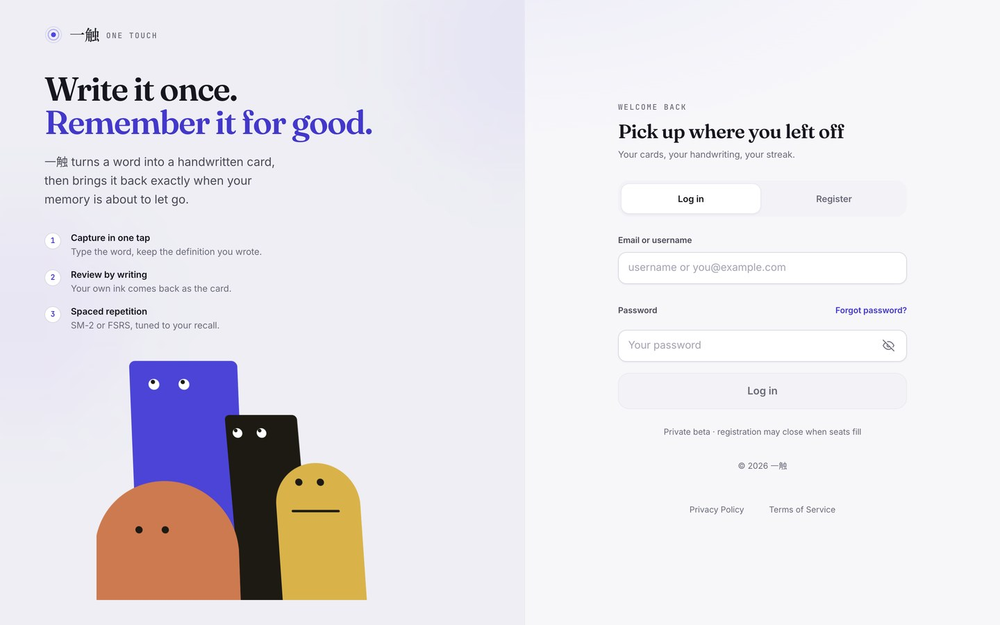</td>
    <td width="50%">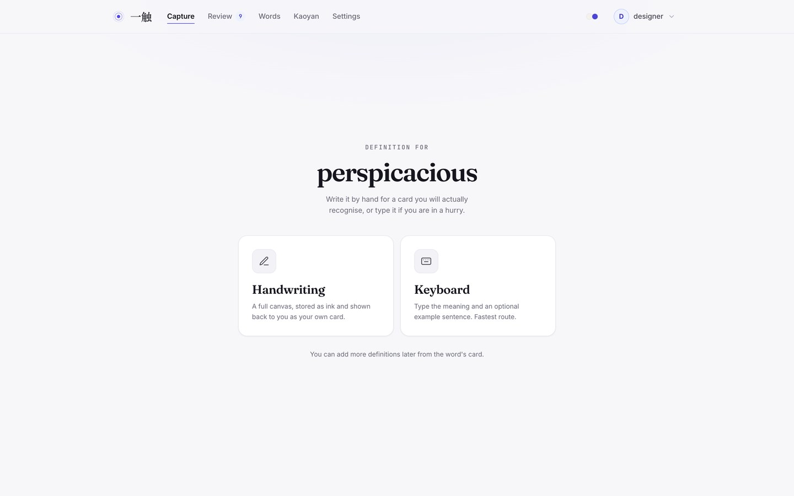</td>
  </tr>
  <tr>
    <td width="50%">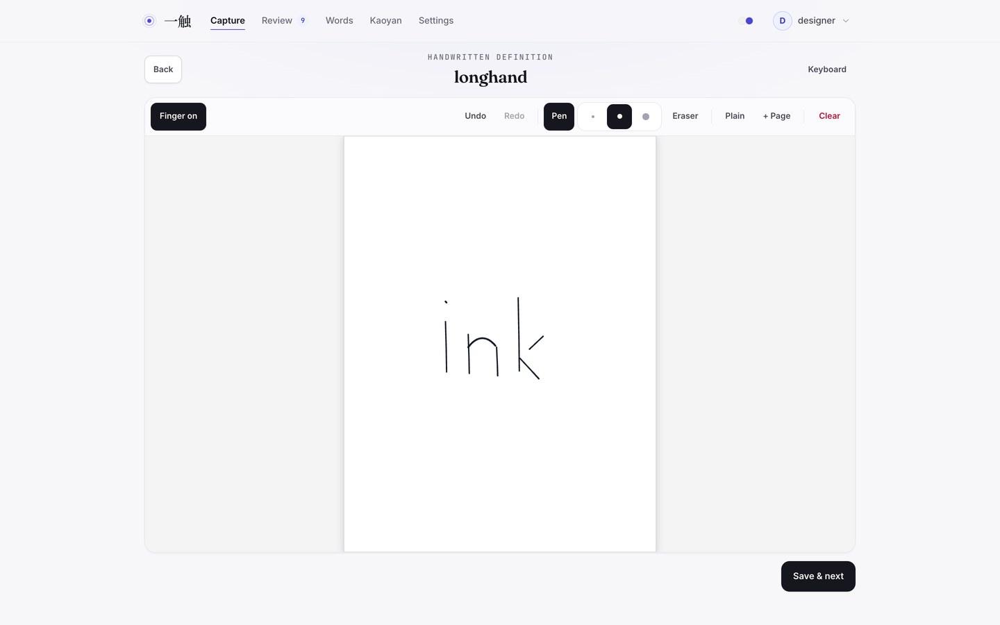</td>
    <td width="50%">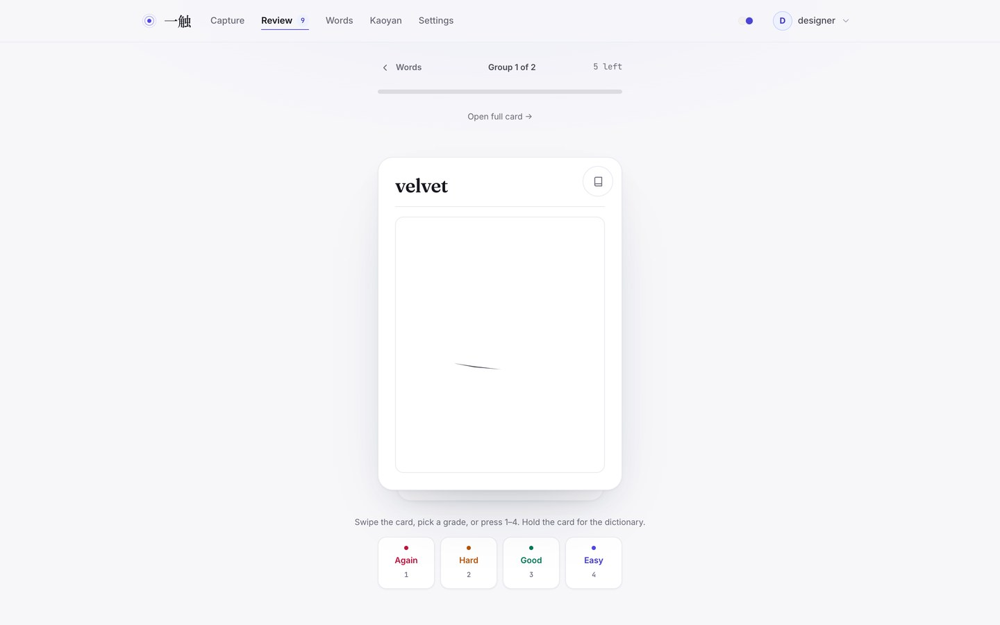</td>
  </tr>
  <tr>
    <td width="50%">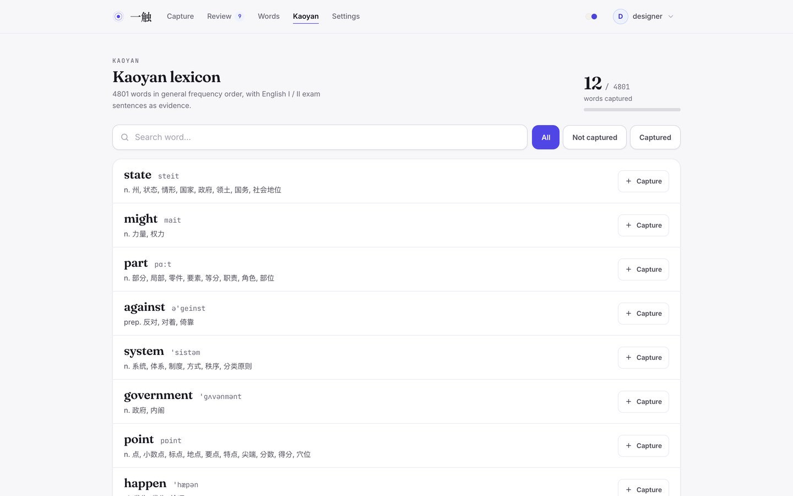</td>
    <td width="50%">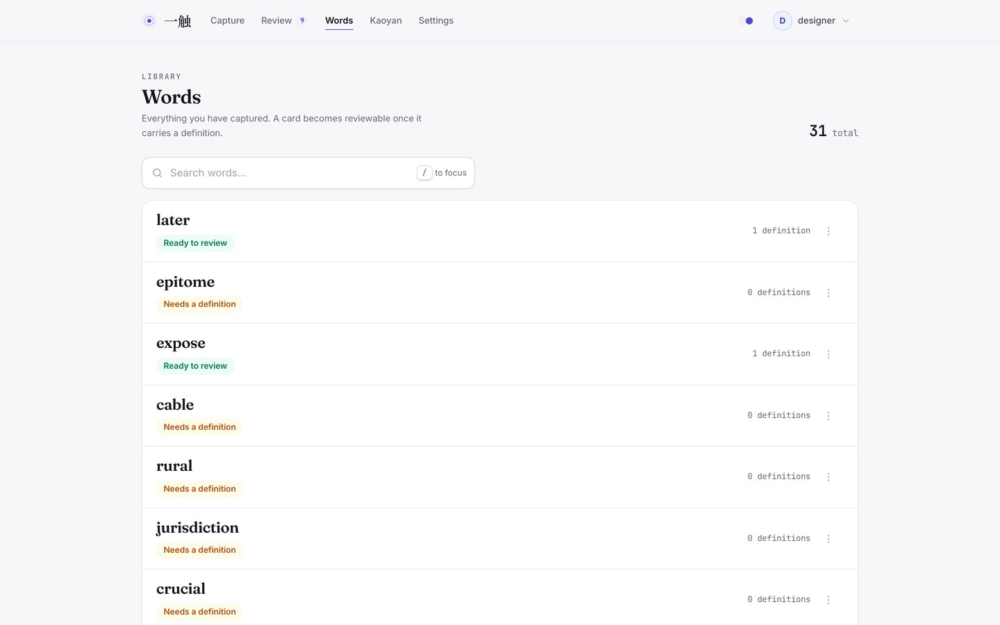</td>
  </tr>
  <tr>
    <td width="50%">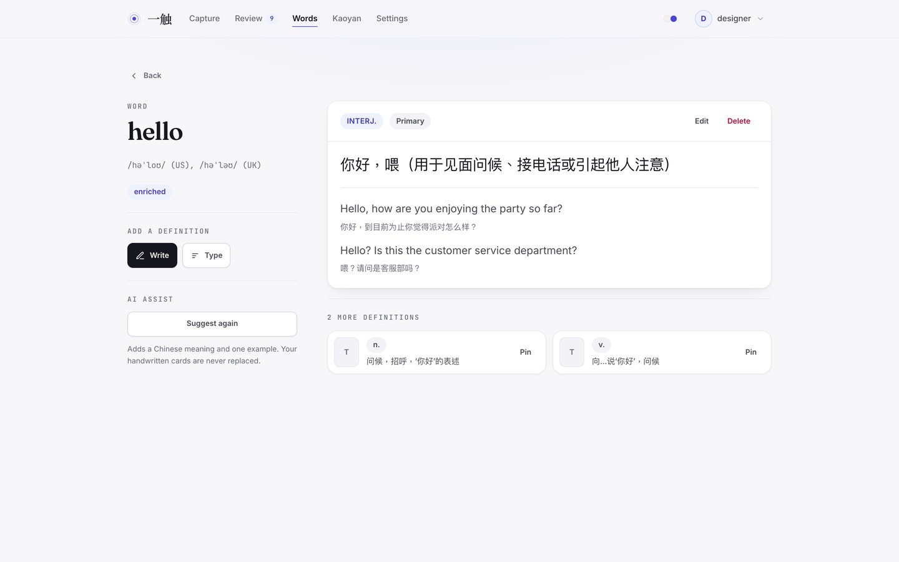</td>
    <td width="50%">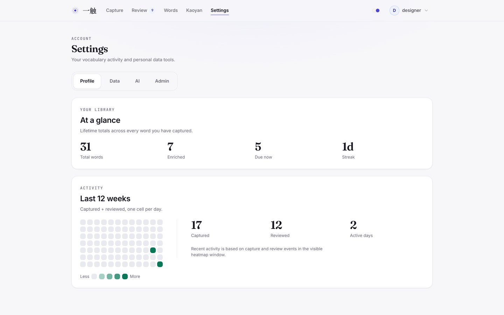</td>
  </tr>
  <tr>
    <td width="33%">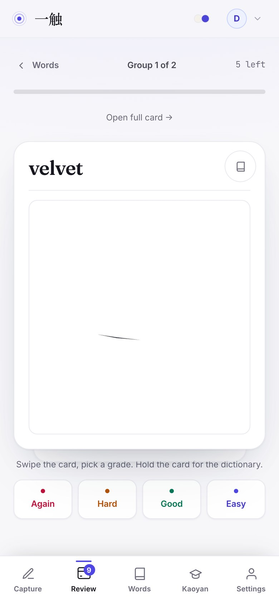</td>
    <td width="33%">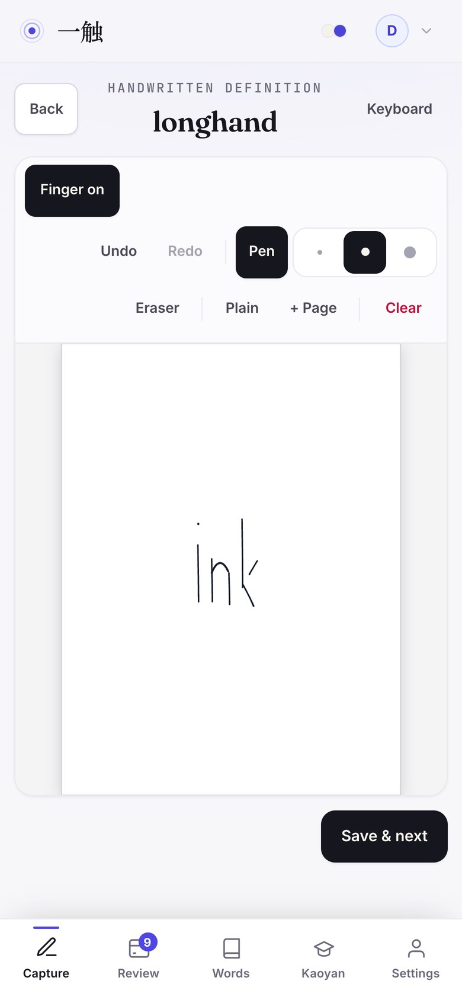</td>
    <td width="33%">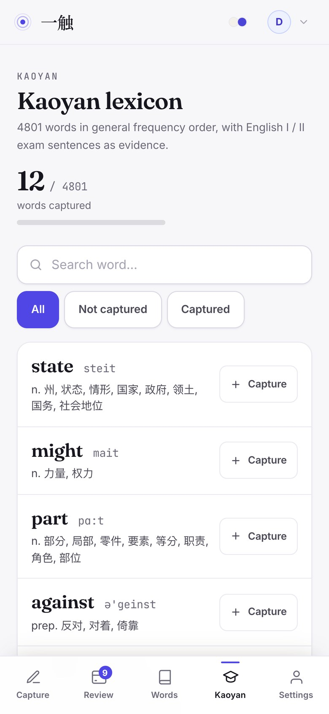</td>
  </tr>
</table>

## 它能做什么

**收词。** 一个输入框、一个词，然后决定是手写还是键盘输入。手写释义会存两份：`ink_data`
（矢量笔画，ink schema v3）和 WebP 预览 `canvas_image`（列表与缩略图用）。草稿通过
IndexedDB 保留（不可用时回落 localStorage），写了一半刷新也不会丢。

**书写。** 画布是固定的 3:4 竖版纸，可逐页扩展，预览里会连同样式一起渲染平面 / 横线 / 格子。
三档笔宽（细 / 标准 / 粗）、按笔画命中的矢量橡皮、撤销重做、0.5×–4× 双指缩放与双指平移。
输入经过 one-euro 滤波，笔迹宽度跟随压感、速度与倾角，压感就是压感。默认**仅笔**模式，
手撑在屏幕上不会画出线；需要时切到「手指可用」。另有笔迹诊断页 `/handwriting-lab`。

**复习。** 卡片按 SM-2 或 FSRS 调度回归（可配置，含 Asia/Shanghai 日界与目标可提取度）。
滑动或按 `1`–`4` 评分（Again / Hard / Good / Easy），`Space` 翻面。手写卡就是你当初写的样子。
复习可离线：评分先入本地队列，联网后自动补交。

**考研词库。** 内置 **4,801 个词**（按通用词频排序），配 **3,978 条真题例句**作为证据——
英语一 2005–2024、英语二 2010–2025。可搜索、按「全部 / 未收录 / 已收录」筛选、一键收词，并
看到自己的覆盖率。已收录的词会带着例句证据进复习：在复习卡上长按卡面（或点词典按钮），
不离开复习就能展开释义与对应真题句子。

**词库与 AI 增强。** 支持搜索与分页，能看到哪些卡已经可复习；一个词可以有多条释义（手写或
键盘），并指定主释义，另存搭配与例句。可选的 AI 增强会补上词性、中文释义和一条中英对照例句
——它永远不会覆盖你自己写的释义，密钥只留在服务端；额度按用户每日计（默认 5 次，管理员不限）。

**账号与运维。** 账号默认由管理员开通；需要时可开启邮箱验证码自助注册（配 SMTP 与人数上限）。
单词、释义、复习记录都按属主隔离。改密码会让此前签发的令牌全部失效，停用账号会直接锁定登录；
认证接口同时按账号和 IP 限流；非调试模式下，默认管理员口令或短于 32 位的 `AUTH_SECRET` 会直接
拒绝启动。数据通过 JSON 导入导出（merge 或 replace）迁移，SQLite 自动备份（启动时 + 每 24 小时，
保留 7 天），app / access 日志落盘，设置页可查看版本、备份状态与 AI 额度；反馈与前端错误写入
服务端 JSONL。

## 设计

界面是一套令牌，而不是每页各自发挥——**暖纸上的墨**：暖中性色，一个交互色相、一个强调色相，
13 级封闭字阶，对比度实测（正文 16.2:1、次级 8.5:1）。内置两套外观，顶栏一键切换：
**Violet**（默认）与 **Paper**。字体为自托管可变字体（Inter / Fraunces / JetBrains Mono），
不依赖任何字体 CDN。规则与可复现的审计脚本（对比度、点击目标、横向溢出、字阶漂移、动效预算）
见 [docs/design-system.md](docs/design-system.md)。

## 技术栈

| 层次 | 选型 |
| --- | --- |
| 接口 | FastAPI、SQLAlchemy 2 异步 ORM、Pydantic v2、SQLite（aiosqlite） |
| 调度 | 自实现 SM-2 与 FSRS 风格 D/S/R 调度器，统一 `BaseSRS` 接口 |
| 模型 | OpenAI / Anthropic / Doubao（火山方舟）/ Ollama，统一工厂 |
| 前端 | React 19、TypeScript、Vite、Zustand、Tailwind CSS 4、Headless UI、Framer Motion |
| 手写 | 分层 canvas + `perfect-freehand` 轮廓渲染，WebP 预览导出 |
| 应用外壳 | 可安装 PWA：manifest、Service Worker、由用户决定的更新提示 |
| 部署 | Docker Compose：后端、前端静态镜像、带 TLS 的 nginx 网关 |

## 快速开始

依赖：Python 3.12+、[uv](https://docs.astral.sh/uv/)、Node 20+。

```bash
# 1. 后端
uv sync
cp .env.example .env          # 然后设置管理员口令和足够长的 AUTH_SECRET
uv run uvicorn backend.main:app --reload --port 8000

# 2. 前端（另开一个终端）
cd frontend
npm install                   # 用 pnpm install 也可以
npm run dev                   # http://127.0.0.1:5173，/api 代理到 :8000
```

首次启动会用 `.env` 里的管理员账号初始化数据库，并把 `data/kaoyan/` 里的考研语料导入。
数据库默认位于 `~/.glm-words/words.db`，可用 `GLM_WORDS_DATABASE_URL` 改。

> **关于考研语料。** `data/kaoyan/` 由 `scripts/kaoyan/` 在本地从真题和第三方词典生成，**不随源码
> 分发**（这些输入本身不能再分发）。没有它应用照样启动，其他功能全部可用，只是考研词库为空。
> 所以公开仓库 clone 下来会看到一个空词库，直到你自己构建语料。

> 非调试模式下，使用默认管理员账号口令、或 `AUTH_SECRET` 短于 32 位，服务会拒绝启动。

### 环境变量

全部通过环境变量配置，可从 `.env.example` 起步。

| 变量 | 默认值 | 作用 |
| --- | --- | --- |
| `GLM_WORDS_ADMIN_USERNAME` / `_PASSWORD` | `admin` / `change-me` | 初始化管理员 |
| `GLM_WORDS_AUTH_SECRET` | `change-this-secret` | 令牌签名密钥（非调试需 ≥ 32 位） |
| `GLM_WORDS_DATABASE_URL` | `~/.glm-words/words.db` | SQLite 位置 |
| `GLM_WORDS_ALLOWED_ORIGINS` | `localhost:5173`、`127.0.0.1:5173` | CORS 白名单 |
| `GLM_WORDS_REVIEW_ALGORITHM` | `sm2` | `sm2` 或 `fsrs` |
| `GLM_WORDS_TARGET_RETRIEVABILITY` | `0.9` | FSRS 目标可提取度 |
| `GLM_WORDS_REVIEW_TIMEZONE` / `_DAY_BOUNDARY_HOUR` | `Asia/Shanghai` / `4` | 「今天」从几点算起 |
| `GLM_WORDS_ENRICH_DAILY_LIMIT` | `5` | 每用户每日 AI 增强次数 |
| `GLM_WORDS_LLM_PROVIDER` | `ollama` | `openai` · `anthropic` · `doubao` · `ollama` |
| `GLM_WORDS_LLM_MODEL`、`_BASE_URL`、`_API_KEY`、`_OPENAI_API_KEY`、`_ANTHROPIC_API_KEY`、`_DOUBAO_API_KEY` | — | 模型凭据，仅服务端 |
| `GLM_WORDS_REGISTRATION_ENABLED` / `_MAX_USERS` | `false` / `30` | 邮箱验证码自助注册 |
| `GLM_WORDS_SMTP_HOST` / `_PORT` / `_USERNAME` / `_PASSWORD` / `_FROM` / `_TLS` | — | 验证码邮件（未配置时写到日志） |
| `GLM_WORDS_BACKUP_ENABLED` / `_DIR` / `_RETENTION_DAYS` / `_INTERVAL_HOURS` | `true` / `~/.glm-words/backups` / `7` / `24` | SQLite 备份 |
| `GLM_WORDS_LOG_DIR` | `~/.glm-words/logs` | `app.log` 与 `access.log` |
| `GLM_WORDS_DEBUG` | `false` | 跳过生产密钥校验 |

前端在构建期读取 `VITE_API_BASE_URL`、`VITE_APP_VERSION`、`VITE_BUILD_DATE`、`VITE_ICP_RECORD`。

## Docker

```bash
cp .env.example .env          # 填好密钥
docker compose up -d --build
```

Compose 会起后端、前端静态镜像和 nginx 网关（80/443，证书挂到 `/etc/letsencrypt`）。数据库、
备份与日志等持久状态放在 `glm_words_data` 卷的 `/data` 下。

## 目录结构

```text
backend/        FastAPI：路由、服务、模型、认证、SRS 调度器、LLM Provider
  srs/          BaseSRS 接口下的 SM-2 与 FSRS 实现
  tests/        核心链路测试（收词 → 复习 → 同步 → 增强 → 认证）
frontend/       React PWA：页面、组件、状态、设计令牌
  src/styles/   令牌、基础样式、外壳与组件词汇
  scripts/design/  可复现的设计 / 对比度 / 溢出审计工具
data/kaoyan/    生成好的考研词库与真题例句语料
scripts/kaoyan/ 语料构建与导入工具
docs/           设计系统、变更日志、部署与手写相关文档
```

## 开发与测试

```bash
# 后端：36 条测试
uv run python -m pytest backend/tests/test_core_flows.py

# 前端：lint、6 个文件 27 条测试、生产构建
cd frontend
npm run lint && npm run test && npm run build

# 可选：对运行中的界面做量化审计（对比度、点击目标、溢出、字阶漂移）。
# 需要 playwright-core 和上面的 dev server，见 frontend/scripts/design/README.md
node scripts/design/audit.mjs /tmp/audit
```

## 文档

| 文档 | 内容 |
| --- | --- |
| [docs/design-system.md](docs/design-system.md) | 令牌体系、外观、字体与审计规则 |
| [docs/CHANGELOG.md](docs/CHANGELOG.md) | 按日期记录的已完成变更（最新在前） |
| [docs/project-progress.md](docs/project-progress.md) | 当前状态、风险与下一步 |
| [docs/handwriting-technical-report.zh-CN.md](docs/handwriting-technical-report.zh-CN.md) | 手写链路技术说明 |
| [docs/handwriting-stylus-experience-plan.zh-CN.md](docs/handwriting-stylus-experience-plan.zh-CN.md) | 手写体验路线图 |
| [docs/CANVASPAD-v2.md](docs/CANVASPAD-v2.md) | CanvasPad 模块划分 |
| [docs/beta-deployment-checklist.md](docs/beta-deployment-checklist.md) | 上线与内测清单 |

## 安全说明

- LLM Key 只放服务端，前端不接触。
- 生产环境务必设置强 `GLM_WORDS_AUTH_SECRET`，并改掉默认管理员口令。
- 在网关终止 TLS，`GLM_WORDS_ALLOWED_ORIGINS` 保持最小。
- 不要提交 `.env`、`*.db`、备份、日志和运行时 JSONL。

## License

MIT，见 [LICENSE](LICENSE)。
